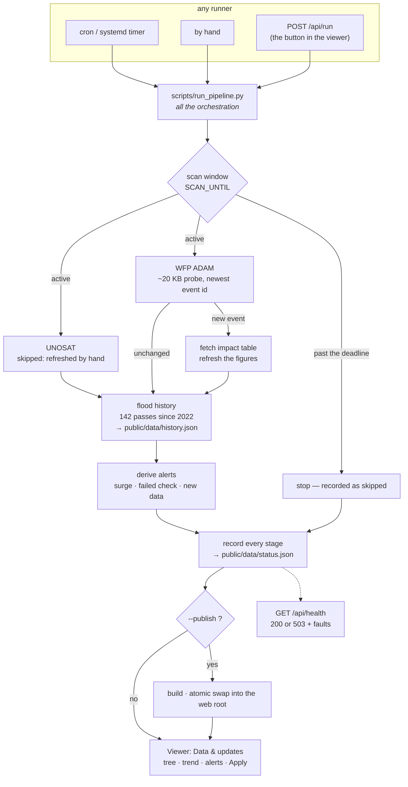

# myanmar-flood-viewer

A map viewer for flooding in Myanmar, from three sources that answer different questions:

- **UNOSAT FloodAI** — an AI detector over Sentinel-1, covering the **whole country** and refreshed
  as imagery arrives. One point per township: people exposed, flooded area, flooded cropland.
  This is the layer that tells you *how many people are under water, where, right now*.
- **UNOSAT hand-traced extents** — precise flood outlines, but only for four regions and only for
  the dates an analyst processed. Observed extent, with **no depth attached**.
- **WFP ADAM** — event-level impact by administrative unit, as a cross-check on the above.

The traced extents cover about a fifth of the people the nationwide layer counts — Sagaing and
Ayeyarwady are usually worst hit and have no traced outline here at all.

Self-contained: it runs, updates and serves itself from one machine. No CI service, no hosting
platform, no account anywhere.

> This site is built and published by an individual. It is not an official site of UNOSAT, WFP or
> any humanitarian agency. It is not a statutory hazard map. Radar misses water under dense
> vegetation and inside buildings, so an absent polygon is not proof of dry ground.

- Flood extents: [UNOSAT via HDX](https://data.humdata.org/organization/unosat) (CC BY-SA)
- Impact figures: [WFP ADAM](https://api.adam.geospatial.wfp.org) (CC BY-SA)
- Region boundaries: [geoBoundaries](https://www.geoboundaries.org/) (ODbL)
- Basemap: [© OpenStreetMap contributors](https://www.openstreetmap.org/copyright) / [OpenFreeMap](https://openfreemap.org/)

### Licence

Code is **MIT** (see [LICENSE](LICENSE)). The flood data committed under `public/data/` is **not** —
it is UNOSAT and WFP material under **CC BY-SA**, with boundaries from geoBoundaries under **ODbL**,
and share-alike terms that MIT cannot override. Anything fetched at run time keeps its own licence
too; note that the **Cloud-free** basemap (EOX Sentinel-2 cloudless) is **CC BY-NC-SA 4.0** — the NC
means non-commercial. [NOTICE](NOTICE) spells all of this out.

### Origin

This began as [shiwaku/chiba-flood-viewer](https://github.com/shiwaku/chiba-flood-viewer), a viewer
for the August 2026 floods in Chiba, Japan, and follows the panel and theme conventions of
[shiwaku/dm-converter](https://github.com/shiwaku/dm-converter/tree/main/viewer). It has since been
rebuilt for Myanmar: different data sources, a React front end, a local server, and a pipeline that
no longer depends on any hosted CI. The Japanese data, its scanner and the Japan-only basemaps are
gone; the early commits in this repository are that original work.

## Regions

| Region | Event | Imaged | Flood risk share | ADAM impact (people) |
|---|---|---|---:|---:|
| Yangon Region | monsoon | 2021-08-25 & 08-31 | 53.3% | 962 |
| Bago Region | monsoon | 2021-08-25 & 08-31 | 30.0% | 153,336 |
| Mandalay Region | Typhoon Yagi | 2024-09-15 & 09-24 | 13.3% | — |
| Nay Pyi Taw Union Territory | Typhoon Yagi | 2024-09-15 & 09-24 | 3.3% | — |

Event dates differ by region because no single UNOSAT product covers all four.

> **The Yangon extent layer is nearly empty (19 polygons), and that is a limit of the imagery, not a
> finding.** The 2021 analysis extent barely reaches Yangon Region. Turn on **Estimation extent** to
> see exactly what was assessed — the boundary runs east of Yangon city.

**Two figures per region, and they disagree.** *Flood risk share* was supplied to this project and
is marked **unverified** — it is exactly 16/9/4/1 of 30 records, so a tally rather than a modelled
probability, and its origin is undocumented; *ADAM impact* is observed, sourced and dated. Across five ADAM
events Bago accounts for ~85% of affected people and Yangon ~5% — close to the inverse of the risk
shares. They may simply measure different things (exposure versus outcome), which is why both are
shown, each labelled.

## Layers

| Layer | Source data | Contents |
|---|---|---|
| All surface water | `waterextent` | Every water surface detected, permanent rivers and lakes included. Drawn under the flood layers as a baseline |
| Flood water (earlier pass) | `floodextentearly` | An earlier satellite pass, where UNOSAT published two dates. What still shows through had drained by the later date |
| Detected flood water | `floodextent` | The flood extent for the main date. One flat colour — it carries no depth |
| Estimation extent | `inputarea` | The area actually analysed. Blank ground outside it means nobody looked, not that it was dry |
| People exposed | `exposure` | **Nationwide.** One circle per township, area proportional to people under detected water. The only layer measured in people rather than water |

## Running it

```bash
npm install
npm start        # build, then serve on http://127.0.0.1:5180
```

`npm start` runs the local Node server, which serves the site **and** exposes the pipeline:

| | |
|---|---|
| `GET /api/status` | the published pipeline status |
| `GET /api/run` | the state of the current or last run |
| `POST /api/run` | start a run — this is what the **Run update now** button calls |

With the server running, the panel's trigger button works. Served as plain static files the page
still works fully; it just detects there is no backend and hides the button.

The server binds to `127.0.0.1` and has **no authentication** — `POST /api/run` executes a pipeline
on the machine. Put a reverse proxy with auth in front of it before exposing it anywhere.

```bash
npm run dev                    # Vite dev server, http://localhost:5175
npm run serve                  # server only, against an existing dist/
PORT=8080 PUBLISH_DIR=/var/www/flood npm run serve
npm run status                 # print the pipeline status tree
```

Stack: **React + MapLibre GL JS + Vite + TypeScript**, a **zero-dependency Node server**, and a
`scripts/` directory that is **standard-library Python only** — no GDAL, no pip packages.

### Layout

```
src/App.tsx              state and layout
src/components/          Panel, Dialogs
src/useMapOverlays.ts    MapLibre lifecycle — the map lives in a ref, not in state
src/layers.ts            the data model and layer definitions
server/index.mjs         static serving + the pipeline API
```

The map is deliberately outside React's render cycle: it is a mutable imperative object, so it is
created once into a ref. The one subtlety is `style.load` — switching basemap or theme replaces the
whole style and drops every layer the app added, so they are re-added from a ref that each render
keeps current. A plain closure there would capture stale state and silently redraw the wrong data.

## The update pipeline



The dialog shows two timestamps, and the difference between them is the point:

| | Means | Comes from |
|---|---|---|
| **Data as of** | when the data itself last changed | `index.json` |
| **Last checked** | when the pipeline last looked, whether or not it found anything | `status.json` |

The dialog draws the run as a **horizontal stepper** — one node per stage, connected by a line that
fills as the work completes. During a run it moves live: the pipeline announces its plan up front
and marks each stage as it starts and finishes, so the display follows the process actually doing
the work rather than guessing. Click any node for that stage's full name, outcome, duration and
detail — including *why* a stage was skipped. A failed stage turns its node and the line after it
red, and the stepper is reachable mid-run whether the run was started here, by cron, or in another
tab.

**Trigger it yourself** from the viewer: **Data & updates → Details → Run update now**. One click
refreshes everything — FloodAI exposure, ADAM impact, the multi-year history, and the rainfall and
river forecasts. With the
local server running that button executes the pipeline on this machine; served as plain static files
it hides itself, because a static page has no backend to accept a request.

`public/data/status.json` is written on *every* run, so a quiet pipeline is distinguishable from a
broken one. It carries the full stage tree — what ran, how it went, how long it took, and on which
machine — which is the only thing the viewer needs to draw the pipeline.

When new data is found, nothing moves on the map until you press **Apply to map**. It swaps the
sources in place, so your view, layer toggles and opacity all survive.

### Self-hosting

The pipeline builds the site and hands it straight to your own web server. No git, no tokens, no
third-party service.

```bash
# one-off
python3 scripts/run_pipeline.py --publish /var/www/flood

# what it does: probe ADAM → record status → vite build → swap into /var/www/flood
```

The swap is atomic — the new site is built beside the target and renamed into place — so a visitor
never sees a half-copied directory, and a failed build leaves the previous site untouched.

**Schedule it** with cron, matching the twice-daily rhythm:

```cron
0 1,13 * * * cd /srv/flood-viewer && /usr/bin/python3 scripts/run_pipeline.py --publish /var/www/flood >> /var/log/flood.log 2>&1
```

**Point your web server at it.** The site is plain static files. nginx:

```nginx
server {
    listen 80;
    server_name flood.example.org;
    root /var/www/flood;
    index index.html;

    # The GeoJSON is a few MB and changes only when the pipeline republishes.
    location /data/ { add_header Cache-Control "public, max-age=300"; }
    # Hashed asset filenames, so these can be cached hard.
    location /assets/ { add_header Cache-Control "public, max-age=31536000, immutable"; }
}
```

Caddy, if you want HTTPS handled for you:

```caddy
flood.example.org {
    root * /var/www/flood
    file_server
}
```

**Serving under a sub-path** instead of a domain root? Vite bakes the base path into every asset
URL, so it has to be set at build time:

```bash
BASE_PATH=/flood/ python3 scripts/run_pipeline.py --publish /var/www/html/flood
```

**Requirements**: Python 3 (standard library only) and Node for the build step. Nothing else — no
GDAL, no pip packages, no database.

**Nothing in the served page talks to any third party except the basemap tiles.** The pipeline
records its own stage tree into `status.json`, so the orchestration view needs no external service.


### Monitoring

Three things are watched, and they answer different questions.

**The trend** — `scripts/history.py` reconstructs a multi-year series from every FloodAI archive
UNOSAT still publish: 142 single-pass observations from March 2022 to the current event, in
`public/data/history.json`. The panel draws it.

Two things about that chart are deliberate and worth knowing before reading it:

- **Bars, evenly spaced, not a time axis.** These are discrete satellite passes; joining them with a
  line would invent values for days nobody looked. The record also has real holes — UNOSAT keep a
  limited number of archives, and there is *nothing at all* through 2025 — so a hatched gap marker is
  drawn wherever consecutive passes are months apart, and the "vs" figure names the date it is
  comparing against rather than saying "previous pass" across a two-year jump.
- **A pass covers a strip, not the country.** A low bar can mean a narrow swath rather than less
  water, so hovering any bar shows all four measures for that pass — people, flooded area, cropland
  and the area actually observed — with the share of the observed strip that was under water.

**One archive is wrong, and the guard is a ratio rather than a name.** `AI20230724MMR` reports
population roughly 125× too high — one township credited with 13.6 million people against 575 km² of
water. Left alone it put a **107-million-person** spike on the chart, twice the population of the
country. Every observation is now checked against the ratio the other four archives agree on
(100–180 people per km² flooded, stable across 2022, 2023, 2024 and 2026); anything an order of
magnitude beyond that has its population withheld and its areas kept, drawn hollow. That catches the
*next* bad archive too, which naming this one would not. 25 observations are currently withheld and
the peak is a plausible 1,717,487 on 2024-07-30.

**Alerts** — `scripts/alerts.py`, derived on every run into `status.json`. Nothing is pushed
anywhere; they are recorded and drawn in the panel, and adding a channel later means reading the
same list. A **surge** is judged against the median of the preceding twelve passes rather than a
fixed number, because a fixed threshold is wrong the moment the usual level moves — the current
event raises one at 25× the recent median. A **failed check** is always critical, because a check
that did not complete must never be able to render as "nothing new".

**Staleness is the reader's to compute, never the file's.** A status file cannot know it has gone
stale — it goes stale by sitting still, long after it was written. So `status.json` carries the
*threshold* (`alerts.freshness.runHours`) and both the page and `/api/health` apply it to
`generatedAt` at read time. Past it, the page raises a critical alert and the verdict chip reads
**stale** instead of "up to date": a fortnight-old check is not evidence of anything current, and
saying otherwise is exactly the claim this project exists not to make.

**Pipeline health** — `GET /api/health` answers from disk on every request, so it stays honest when
the pipeline behind the server dies. **200** when the last run is recent and clean, **503** with a
`faults` array when it is not. That 503 is the one signal worth wiring to an external monitor,
because the site can be perfectly healthy and completely out of date, and only the age of the run
says so. Running it unattended is in [`deploy/`](deploy/): systemd units for a Linux server, and
`deploy/launchd/install.sh` for macOS, which has no systemd. Both keep the update job separate from
the web server, so a crashed server never silently stops the data updating.

### Weather

Three additions, and one of them changes what this map claims.

**Rainfall on the map** — NASA GIBS / GPM IMERG precipitation rate, drawn *over* the basemap rather
than replacing it, on its own date control. This is an **observation**: step it back to the day a
flood was detected and you see the rain that caused it. Its date is separate from the imagery date
because IMERG is assembled with a longer lag — asking for yesterday returns 404, so a shared control
would silently blank the layer. The key is sampled from NASA's own colour map, so it matches the
pixels; the scale is logarithmic (0.1 → 50 mm/hr), which is why heavy rain is not simply "twice as
red" as light.

**Rainfall forecast** and **river discharge** — Open-Meteo, seven days back and forward for rain,
thirty back and fourteen forward for flow (GloFAS / Copernicus). Both are **forecasts, not
observations**, which makes them the only such figures in this viewer, and the panel says so above
every reading. Forecast bars are drawn hollow so a modelled day cannot be mistaken for a measured
one, and the discharge chart carries the GloFAS ensemble envelope — its own spread widens from about
±1% tomorrow to −11%/+38% two weeks out, and a single confident line would hide that.

Rain is the input, but **river discharge is what actually overtops a bank**, and it carries rain
that fell days ago hundreds of kilometres upstream — so a river can still be rising under a clear
sky. That is why it is the default view.

**The gauge coordinates are not the towns they are named for.** GloFAS is gridded at roughly 5 km, so
a point one cell off the channel reports a local stream. Asking for "Magway" at the town's own
coordinates returned **113 m³/s**; the actual channel nearby carries **30,338** — a 270-fold error,
with nothing in the response to say it is wrong. Every coordinate in `scripts/scan_weather.py` was
found by probing a grid and keeping the largest flow, then checked against the river's known size,
and each records the flow it was chosen at so a future drift off-channel is flagged rather than
published as a hundredfold flood.

The forecast is fetched **by the pipeline, not by the page**, so the served site still contacts
nothing but the basemap tiles. The stage is never fatal: a flood map is complete without a forecast,
so an Open-Meteo outage records `skipped` instead of turning a good run red.

### What is and is not automated

**ADAM is polled** twice a day (~20 KB per check). Only the newest event's impact table is publicly
readable — every older one returns 403 — so there is no backfill.

**UNOSAT is not polled.** Its products are 8–282 MB and the region clipping needs hand-tuned
tolerances, boundary files and named exclusions. Automating it would produce a confidently wrong
map, so it is refreshed by hand with `scripts/convert_unosat.py` and recorded in `status.json` as
`skipped` with the reason.

### Scan deadline

Past `SCAN_UNTIL` (an env var, defaulted in `scripts/run_pipeline.py`), a run exits without doing anything. Extend the date to keep going.

## Directories

```
public/data/index.json      the dataset list, read at runtime
public/data/status.json     what the pipeline last checked and found, plus alerts
public/data/history.json    142 satellite passes since 2022 — the trend series
public/data/weather.json    rainfall and river-discharge forecasts
public/data/MM_*/           converted GeoJSON per region
src/                        the viewer
scripts/common.py           shared helpers
scripts/scan_adam.py        poll WFP ADAM, refresh the impact figures
scripts/status.py           write status.json
scripts/history.py          rebuild the multi-year series from every FloodAI archive
scripts/alerts.py           derive surge / failed-check / new-data alerts
scripts/scan_weather.py     rainfall + GloFAS river discharge (verified channel cells)
scripts/convert_unosat.py   convert UNOSAT shapefiles (run by hand)
scripts/run_pipeline.py     the one entrypoint — scan, record, publish
server/index.mjs            static serving + the pipeline API + /api/health
deploy/                     systemd units and a cron line for running it unattended
```

A new location needs no code change — the viewer reads `index.json` at runtime. A layer kind other
than the four above does need adding to `src/layers.ts`.
